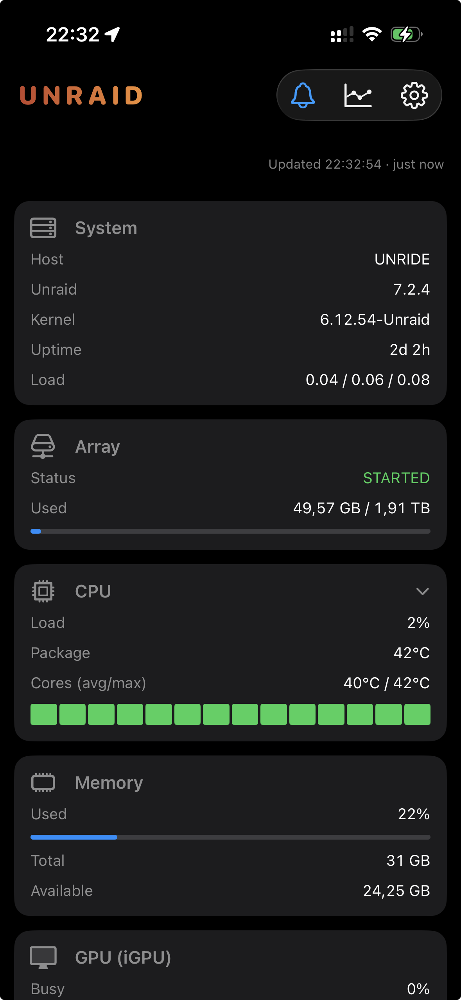
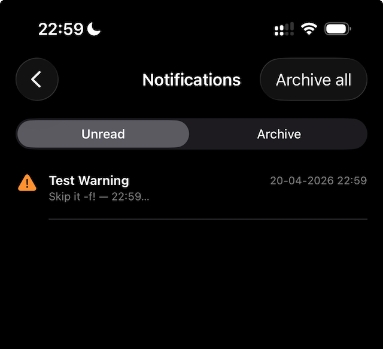
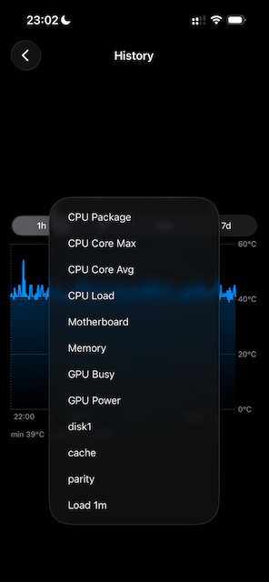
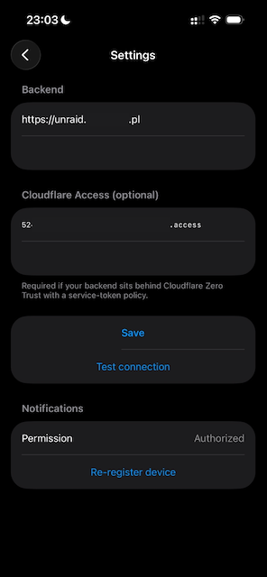

# Unraid iOS Monitor

Monitoring, history and push alerts for a personal Unraid server, consumed by a native iOS app. Backend runs as a Docker container on Unraid, exposed securely through Cloudflare Tunnel + Zero Trust Access. The iOS app is sideloaded over a personal Apple Developer account.

 <div align="center">
    
  </div>

---

## Table of Contents

1. [Architecture](#architecture)
2. [Repository layout](#repository-layout)
3. [Prerequisites](#prerequisites)
4. [One-time setup](#one-time-setup)
   - [1. Unraid API key](#1-unraid-api-key)
   - [2. Apple Developer - APNs p8 key](#2-apple-developer---apns-p8-key)
   - [3. Cloudflare Tunnel ingress rule](#3-cloudflare-tunnel-ingress-rule)
   - [4. Cloudflare Zero Trust Access](#4-cloudflare-zero-trust-access)
   - [5. Bootstrap server directories](#5-bootstrap-server-directories)
   - [6. Backend `.env`](#6-backend-env)
5. [Deploy the backend](#deploy-the-backend)
6. [Build and run the iOS app](#build-and-run-the-ios-app)
7. [Configuration reference](#configuration-reference)
8. [Daily operations](#daily-operations)
9. [Verification and smoke tests](#verification-and-smoke-tests)
10. [Troubleshooting](#troubleshooting)
11. [Security model](#security-model)
12. [Reboot survival](#reboot-survival)
13. [Gallery](#gellery)

---

## Architecture

```
┌───────────────────────────────────────────────────────────────────────┐
│  Unraid host (<UNRAID_IP>)                                          │
│  ┌──────────────────────┐    ┌──────────────────────────────┐         │
│  │ unraid-api (nginx →  │    │ /sys /proc /boot /dev/dri    │         │
│  │ /graphql via socket) │    │ /var/local/emhttp            │         │
│  │ header x-api-key     │    │ + intel_gpu_top (CAP_PERFMON)│         │
│  └──────────▲───────────┘    └──────────────▲───────────────┘         │
│             │ GraphQL                        │ bind mounts            │
│  ┌──────────┴──────────────────────────────────┴────────┐             │
│  │ unraid-monitor-backend (Docker, network_mode: host)   │             │
│  │  Fastify + TypeScript                                 │             │
│  │  - /api/snapshot (unraid + hwmon + gpu + system)      │             │
│  │  - /api/actions/docker/:id/:action                    │             │
│  │  - /api/actions/parity/(pause|resume|cancel)          │             │
│  │  - /api/notifications (list) + /stream (SSE)          │             │
│  │  - /api/history?metric=...&range=...                  │             │
│  │  - /api/devices (APNs token registration)             │             │
│  │  Samples to SQLite every 10 s (7-day retention)       │             │
│  │  APNs push via apns2 (p8, HTTP/2)                     │             │
│  │  Auth: Bearer APP_TOKEN (timing-safe)                 │             │
│  └──────────────────────────▲────────────────────────────┘             │
│                             │ localhost:3000                          │
│  ┌──────────────────────────┴────────────────────────────┐             │
│  │ cloudflared tunnel (native, not Dockerised)           │             │
│  │ /boot/config/cloudflared-conf/config.yml              │             │
│  │ tunnel: <TUNNEL_NAME>                                      │             │
│  └──────────────────────────▲────────────────────────────┘             │
└─────────────────────────────┼─────────────────────────────────────────┘
                              │ QUIC out → Cloudflare edge
                              │
                   ┌──────────┴────────────┐
                   │ Cloudflare (PoP)       │
                   │  - TLS terminate      │
                   │  - Zero Trust Access  │
                   │    (Service Auth)     │
                   │  - DDoS / WAF         │
                   └──────────▲────────────┘
                              │ HTTPS
                  ┌───────────┴──────────────┐
                  │ iPhone (iOS 17+)          │
                  │  SwiftUI, native APNs     │
                  │  Keychain: APP_TOKEN +    │
                  │           CF Access pair  │
                  └───────────────────────────┘
```

Public hostname: `<PUBLIC_URL>` (CNAME to `<tunnel-id>.cfargotunnel.com`, proxied through Cloudflare).

**Placeholders used throughout this doc.** Replace them with your own values or, if you just need the live ones, look in `backend/.env`:

- `<UNRAID_IP>` — LAN IP of the Unraid host (`UNRAID_HOST=root@<ip>` in `backend/.env`).
- `<PUBLIC_URL>` — full public URL served by Cloudflare Tunnel, e.g. `https://unraid.your-domain.pl` (`PUBLIC_URL` in `backend/.env`).
- `<PUBLIC_HOST>` — the bare hostname (same URL without the scheme), used when configuring DNS / Access.
- `<YOUR_DOMAIN>` — the Cloudflare zone you own (for the Access "Application domain" field).
- `<TUNNEL_NAME>` — the cloudflared tunnel name you run on the host.
- `<KEYID>` — the 10-char ID of your APNs p8 key (`APNS_KEY_ID`).
- `<APP_TOKEN>` — the 64-hex-char backend Bearer token (`APP_TOKEN`).
- Cloudflare Access service-token values live in `backend/.env` as `CF_ACCESS_CLIENT_ID` / `CF_ACCESS_CLIENT_SECRET`.

---

## Repository layout

```
unraid-monitor/
├── backend/                       # Node.js 22 + Fastify + TS
│   ├── src/
│   │   ├── server.ts              # bootstrap, auth, routes
│   │   ├── config.ts              # zod-validated env
│   │   ├── auth.ts                # Bearer middleware (timing-safe)
│   │   ├── unraidClient.ts        # Unraid GraphQL wrapper
│   │   ├── apns.ts                # APNs via apns2
│   │   ├── collectors/
│   │   │   ├── hwmon.ts           # /sys/class/hwmon parser
│   │   │   ├── gpu.ts             # intel_gpu_top + DRM hwmon
│   │   │   ├── system.ts          # /proc/meminfo, uptime, loadavg
│   │   │   └── snapshot.ts        # aggregator
│   │   ├── routes/                # ping, snapshot, actions, devices,
│   │   │                          # history, notifications (+ SSE)
│   │   ├── storage/db.ts          # better-sqlite3 (devices, samples,
│   │   │                          # seen_notifications)
│   │   └── worker/                # notificationsPoller, sampler
│   ├── Dockerfile                 # node:22-slim + intel-gpu-tools + tini
│   ├── docker-compose.yml
│   ├── deploy.sh                  # rsync + compose + logs helper
│   └── .env.example
│
├── ios/
│   ├── project.yml                # XcodeGen spec
│   └── UnraidMonitor/
│       ├── UnraidMonitor.entitlements   # aps-environment: development
│       ├── Info.plist
│       ├── UnraidMonitorApp.swift
│       ├── Core/                  # Settings, Keychain, APIClient,
│       │                          # Models, Formatters, Push, AppDelegate
│       └── Features/
│           ├── Dashboard/         # 9 cards + view-model
│           ├── Settings/          # backend URL, tokens, CF Access, push
│           ├── History/           # Swift Charts
│           └── Notifications/     # list with Unread/Archive picker
│
└── README.md                      # this file
```

---

## Prerequisites

### On your Mac (dev)

- macOS 14+
- Xcode 26+ (iOS 17 SDK or later)
- Homebrew packages:
  ```bash
  brew install node@22 xcodegen cloudflared
  ```
- `ssh-agent` set up with a key that can log into `root@<UNRAID_IP>` without a password. All scripts assume this.

### On the Unraid server

- Unraid 7+ with Docker and the [Unraid Connect](https://docs.unraid.net/API/) plugin (ships `unraid-api`). Verify with `unraid-api status`.
- A native `cloudflared` install persisted through `/boot/config/go` (not in Docker). If you are starting fresh, follow Cloudflare's "Install on Linux" guide, copy the binary into `/boot/config/cloudflared`, and extend `/boot/config/go` to copy it back on boot.
- Intel iGPU reporting requires the `intel-gpu-tools` package (used inside the container) plus `cap_add: [PERFMON]` (already in compose). No host-side plugin needed on kernel 6.12.
- `nct6775` motherboard sensor module loads automatically on ASRock B760M-ITX/D4 WiFi (verified). Other boards may need `modprobe nct6775 force_id=0xXXXX` in the go file.

### Apple account

- An **Apple Developer Program** account (the free personal team will not let you sideload stably — you'd need a weekly re-sign).
- Know your **Team ID** (10 chars) from [developer.apple.com → Membership](https://developer.apple.com/account).

---

## One-time setup

### 1. Unraid API key

SSH into the server and create a key for the backend. `ADMIN` role is required because we perform docker and parity mutations.

```bash
ssh root@<UNRAID_IP> \
  'unraid-api apikey --create \
     --name "unraid monitor backend" \
     --roles ADMIN \
     --description "Backend for iOS unraid-monitor app"'
```

Save the printed key — you will paste it into `.env` as `UNRAID_API_KEY`.

> The key is persisted by `unraid-api`; it survives Unraid reboots. Manage keys with `unraid-api apikey --list` / `--delete`.

### 2. Apple Developer - APNs p8 key

1. [developer.apple.com/account/resources/authkeys](https://developer.apple.com/account/resources/authkeys) → **+** → **Apple Push Notifications service (APNs)**.
2. Name it (e.g. `UnraidMonitor APNs`) → **Continue** → **Register**.
3. **Download the `.p8` once** — Apple never shows it again. Note the **Key ID** displayed next to the key (10 chars).
4. Copy the `.p8` into the server so the container can mount it:
   ```bash
   scp AuthKey_XXXXXXXXXX.p8 \
     root@<UNRAID_IP>:/mnt/user/appdata/unraid-monitor/backend/data/
   ssh root@<UNRAID_IP> \
     'chmod 600 /mnt/user/appdata/unraid-monitor/backend/data/AuthKey_*.p8'
   ```

### 3. Cloudflare Tunnel ingress rule

Assumes you already run a single `cloudflared` tunnel on this server (e.g. `<TUNNEL_NAME>`) that serves other subdomains. We only add one entry.

Edit the persistent config `/boot/config/cloudflared-conf/config.yml` and insert a new ingress rule **before** the final `http_status: 404` catch-all:

```yaml
  - hostname: <PUBLIC_HOST>
    service: http://localhost:3000
```

Copy into the active location and reload:

```bash
ssh root@<UNRAID_IP> 'cp /boot/config/cloudflared-conf/config.yml /etc/cloudflared/config.yml'
ssh root@<UNRAID_IP> 'cf-tunnel restart'
```

Add the CNAME from your Mac (cloudflared needs `~/.cloudflared/cert.pem`, obtained once via `cloudflared tunnel login`):

```bash
cloudflared tunnel route dns <tunnel-uuid> <PUBLIC_HOST>
```

Verify: `curl -s <PUBLIC_URL>/healthz` (once the backend is deployed) should return `{"ok":true}`.

### 4. Cloudflare Zero Trust Access

Adds a second auth layer in front of the tunnel. The iOS app will send a static service-token pair; browsers get blocked.

1. [one.dash.cloudflare.com](https://one.dash.cloudflare.com) → **Access controls → Service auth** → **Create Service Token**
   - Name: `unraid-monitor-ios`
   - Duration: `Non-expiring`
   - **Copy both Client ID and Client Secret now** (Secret is shown only once).
2. **Access controls → Applications** → **Add an application** → **Self-hosted and private**.
   - Name: `Unraid Monitor`
   - Application domain: subdomain `unraid`, domain `<YOUR_DOMAIN>`
   - Session Duration: `24 hours`
   - Turn **off** "Accept all available identity providers" (we only use service token).
   - Add a single policy:
     - Name: `iOS service token`
     - Action: **Service Auth**
     - Include: `Service Token` → `unraid-monitor-ios`
   - Save.
3. Smoke test:
   ```bash
   # Expect 403 (blocked by CF):
   curl -s -o /dev/null -w '%{http_code}\n' <PUBLIC_URL>/api/ping
   # Expect 200:
   curl -s \
     -H "CF-Access-Client-Id: <id>" \
     -H "CF-Access-Client-Secret: <secret>" \
     -H "Authorization: Bearer <APP_TOKEN>" \
     <PUBLIC_URL>/api/ping
   ```

The live Client ID and Secret are stored in `backend/.env` (`CF_ACCESS_CLIENT_ID` / `CF_ACCESS_CLIENT_SECRET`) and in the iOS Keychain. They are intentionally not duplicated here so this file is safe to paste around. If you suspect the secret has leaked, immediately delete the token in Zero Trust → Service auth and recreate it (see [Rotation cadence](#rotation-cadence)).

### 5. Bootstrap server directories

```bash
ssh root@<UNRAID_IP> 'mkdir -p /mnt/user/appdata/unraid-monitor/backend/data'
```

This folder will hold:
- `unraid-monitor.db` (SQLite — devices, seen notifications, samples)
- `AuthKey_<KEYID>.p8` (APNs key)

It survives reboots because it lives on the user share (cache pool).

### 6. Backend `.env`

The repo ships two env files (both gitignored):

| File | Purpose | Used by |
|---|---|---|
| [`backend/.env`](backend/.env) | **Production** — live secrets, matches what runs on the server | The container (via compose) and `deploy.sh` |
| [`backend/.env.local`](backend/.env.local) | **Test / staging** — placeholders with faster poll cadence | `deploy.sh` when launched with `USE_ENV_LOCAL=1` |
| [`backend/.env.example`](backend/.env.example) | Minimal committed template for new clones | Reference only |

Precedence for `deploy.sh` variables (first match wins):

1. Shell environment (e.g. `UNRAID_HOST=x ./deploy.sh`)
2. `.env.local` if `USE_ENV_LOCAL=1`
3. `.env`
4. Built-in fallbacks inside the script

Generate a 256-bit app token and write `.env` locally + mirror it to the server. The repo-root copy is what `deploy.sh` uses for targets (UNRAID_HOST etc.); the copy on the Unraid host is what the container reads.

```bash
# 1. Local: make sure backend/.env exists and has APP_TOKEN, UNRAID_API_KEY,
#    APNS_*, plus UNRAID_HOST / REMOTE_PATH / CONTAINER for deploy.sh.
#    Easiest: copy .env.example and fill in live values.
cp backend/.env.example backend/.env
$EDITOR backend/.env

# 2. Server: mirror a minimal subset (the container only needs the runtime vars).
APP_TOKEN=$(grep ^APP_TOKEN= backend/.env | cut -d= -f2-)
ssh root@<UNRAID_IP> "cat > /mnt/user/appdata/unraid-monitor/backend/.env" <<EOF
APP_TOKEN=$APP_TOKEN
UNRAID_API_URL=http://localhost/graphql
UNRAID_API_KEY=<paste key from step 1>
APNS_TEAM_ID=<your Team ID>
APNS_KEY_ID=<Key ID from step 2>
APNS_KEY_PATH=/data/AuthKey_<KEYID>.p8
APNS_BUNDLE_ID=com.cezarmac.unraidmonitor
EOF
ssh root@<UNRAID_IP> 'chmod 600 /mnt/user/appdata/unraid-monitor/backend/.env'

# 3. Keep APP_TOKEN somewhere safe — you'll paste it into the iOS Settings screen.
echo "$APP_TOKEN"
```

> **Why two copies?** The local `backend/.env` also carries deploy-only vars (`UNRAID_HOST`, `REMOTE_PATH`, `CONTAINER`, `CF_ACCESS_CLIENT_*`) that the container doesn't need. Sourcing the whole file into the container environment would be harmless but leaks more than necessary, so we keep the server-side file minimal. When in doubt, copy everything — it just works.

---

## Deploy the backend

All deploys happen through one script: **[`backend/deploy.sh`](backend/deploy.sh)**.

```bash
cd /Users/cezarmac/Developer/priv/unraid-monitor/backend

./deploy.sh             # typecheck → rsync → docker compose up -d --build → log tail + healthcheck
./deploy.sh --quick     # skip rebuild (useful if nothing in Dockerfile/deps changed)
./deploy.sh --logs      # follow container logs
./deploy.sh --status    # container + data volume + restart policy

# Deploy against the test target defined in backend/.env.local:
USE_ENV_LOCAL=1 ./deploy.sh
./deploy.sh --ssh       # interactive shell inside the container
./deploy.sh --help
```

Environment overrides (shell env always wins over `.env` / `.env.local`):

```bash
UNRAID_HOST=root@10.0.0.5 \
REMOTE_PATH=/mnt/user/appdata/unraid-monitor/backend \
CONTAINER=unraid-monitor-backend \
./deploy.sh
```

The script's guarantees:

- Runs `tsc --noEmit` locally before touching the server (fails fast on type errors).
- `rsync -az --delete` with explicit excludes: `node_modules/`, `dist/`, `data/`, `.env`, `deploy.sh`. **Secrets and persistent data on the server never get overwritten.**
- `docker compose up -d --build` recreates the container with the new image.
- Tails the last 15 log lines and runs an unauthenticated `/healthz` check from the host's loopback.

When the backend is healthy, `./deploy.sh` prints `✓ healthz → 200`.

---

## Build and run the iOS app

1. Regenerate the Xcode project (whenever `project.yml` or the source tree changes):
   ```bash
   cd /Users/cezarmac/Developer/priv/unraid-monitor/ios
   xcodegen generate
   ```
2. Open the project:
   ```bash
   open UnraidMonitor.xcodeproj
   ```
3. Select the **UnraidMonitor** target → **Signing & Capabilities**:
   - Team: your developer team (Team ID is in `backend/.env` as `APNS_TEAM_ID`)
   - Ensure **Push Notifications** capability is listed (entitlement already in repo).
4. Connect your iPhone, pick it as the run destination, press **⌘R**.
5. In the app:
   - **Backend URL:** `<PUBLIC_URL>`
   - **API token:** the `APP_TOKEN` you generated in [step 6](#6-backend-env)
   - **Cloudflare Access** section: paste `Client ID` + `Client Secret` from [step 4](#4-cloudflare-zero-trust-access)
   - **Test connection** → expect "Connected. Server time: …"
   - **Save** → the Dashboard appears with 9 live cards.
   - Open Settings → **Enable push** → grant notification permission. The device token is posted to `/api/devices` automatically.

> The app uses `DEBUG` builds → `sandbox` APNs environment, `RELEASE` builds → `production`. The backend stores the environment per device and sends to the correct Apple endpoint.

---

## Configuration reference

### Backend env vars

Runtime env for the Node process (read from `backend/.env` on the server, container picks it up via docker-compose):

| Var | Required | Default | Purpose |
|---|---|---|---|
| `APP_TOKEN` | **yes** | — | 32-byte hex Bearer token. Generate with `openssl rand -hex 32`. |
| `UNRAID_API_URL` | no | `http://localhost/graphql` | Unraid 7+ serves GraphQL through its nginx on port 80, proxied to a unix socket. **Not** `:3001`. |
| `UNRAID_API_KEY` | **yes** | — | Created via `unraid-api apikey --create --roles ADMIN`. Sent as `x-api-key` header. |
| `HOST` / `PORT` | no | `0.0.0.0` / `3000` | Bind target for Fastify (container uses `network_mode: host`). |
| `LOG_LEVEL` | no | `info` | `fatal`/`error`/`warn`/`info`/`debug`/`trace`. |
| `DATA_DIR` | no | `/data` | SQLite + p8 live here. |
| `HOST_SYS` / `HOST_PROC` | no | `/host/sys` / `/host/proc` | Read-only bind-mounted sysfs/procfs. |
| `APNS_TEAM_ID` | no* | — | 10-char Team ID. |
| `APNS_KEY_ID` | no* | — | 10-char Key ID from the p8 filename. |
| `APNS_KEY_PATH` | no* | — | Path **inside the container**, e.g. `/data/AuthKey_XXXXXXXXXX.p8`. |
| `APNS_BUNDLE_ID` | no* | — | Must match the iOS bundle (`com.cezarmac.unraidmonitor`). |
| `NOTIFICATIONS_POLL_INTERVAL_MS` | no | `30000` | How often the backend polls Unraid for new unread notifications. |
| `SAMPLER_INTERVAL_MS` | no | `10000` | Metrics sampler tick rate. |

\* If any APNs var is missing, push is disabled; the backend still boots and logs a warning, and SSE notifications still work.

### Deploy-only env vars (local `backend/.env`)

Not consumed by the Node process — read by `deploy.sh` and kept next to runtime vars for convenience. Safe to mirror to the server too, the container just ignores them.

| Var | Default | Purpose |
|---|---|---|
| `UNRAID_HOST` | `root@<UNRAID_IP>` (set in `.env`) | SSH target for rsync/compose. |
| `REMOTE_PATH` | `/mnt/user/appdata/unraid-monitor/backend` | Where sources + compose file live. |
| `CONTAINER` | `unraid-monitor-backend` | Container name for logs/status/ssh subcommands. |
| `USE_ENV_LOCAL` | unset | Shell env only — when `1`, `deploy.sh` loads `.env.local` instead of `.env`. |
| `CF_ACCESS_CLIENT_ID` / `CF_ACCESS_CLIENT_SECRET` | — | Stored for reference/rotation; the iOS app keeps them in Keychain. |
| `PUBLIC_URL` | — | For docs / future scripts; backend doesn't use it directly. |
| `IOS_BUNDLE_ID` | — | Kept here so a single `.env` documents the whole identity of the deployment. |

### docker-compose (`backend/docker-compose.yml`)

- `network_mode: host` — required so `localhost:80` reaches Unraid's nginx (which proxies `/graphql`).
- `cap_add: [PERFMON]` — needed by `intel_gpu_top` for `perf_event_open` on the i915 PMU. `SYS_ADMIN` is **not** required on kernel 6.12+.
- `devices: [/dev/dri:/dev/dri]` — iGPU access.
- Bind mounts:
  - `/sys:/host/sys:ro` — hwmon source
  - `/proc:/host/proc:ro` — meminfo, uptime, loadavg
  - `/boot:/host/boot:ro` — version/config files if ever needed
  - `/var/local/emhttp:/host/emhttp:ro` — Unraid emhttp state
  - `./data:/data` — persistent app data
- `restart: unless-stopped` — Docker auto-restarts the container on daemon startup (i.e. after reboot).

### Ports already in use on this host

Keep this in mind when adding more services behind the same tunnel:

| Port | Service |
|---|---|
| 80/443 | Unraid webUI (also serves `/graphql`) |
| 3000 | unraid-monitor-backend |

---

## Daily operations

### Viewing logs

```bash
./deploy.sh --logs                            # tail container logs
ssh root@<UNRAID_IP> 'tail -f /var/log/cloudflared.log'   # tunnel logs
ssh root@<UNRAID_IP> 'unraid-api logs'      # Unraid API plugin logs
```

### Rotating the app token

```bash
NEW=$(openssl rand -hex 32)
ssh root@<UNRAID_IP> "sed -i 's/^APP_TOKEN=.*/APP_TOKEN=$NEW/' /mnt/user/appdata/unraid-monitor/backend/.env"
./deploy.sh --quick
# In the iOS app: Settings → replace API token → Save.
echo "$NEW"
```

### Rotating the Unraid API key

```bash
ssh root@<UNRAID_IP> 'unraid-api apikey --delete --name "unraid monitor backend"'
# Recreate per step 1, update .env, then ./deploy.sh --quick
```

### Rotating the APNs key

Generate a new p8 in the Apple Developer portal, replace the file in `data/`, update `APNS_KEY_ID`/`APNS_KEY_PATH`, redeploy. Old keys can be revoked in the portal.

### Backups worth taking

- `/mnt/user/appdata/unraid-monitor/backend/.env`
- `/mnt/user/appdata/unraid-monitor/backend/data/` (SQLite + p8)
- `/boot/config/cloudflared-conf/` (tunnel credentials + config)

### Stopping everything

```bash
ssh root@<UNRAID_IP> 'cd /mnt/user/appdata/unraid-monitor/backend && docker compose down'
ssh root@<UNRAID_IP> 'cf-tunnel stop'
```

---

## Verification and smoke tests

Run these after any non-trivial change.

**1. Local loopback (unauthenticated)**
```bash
ssh root@<UNRAID_IP> 'curl -s http://localhost:3000/healthz'
# → {"ok":true}
```

**2. Backend auth (LAN)**
```bash
TOKEN=<APP_TOKEN>
curl -s -H "Authorization: Bearer $TOKEN" http://<UNRAID_IP>:3000/api/ping
# → {"pong":true,"ts":"...","apns":true}
```

**3. Public path (CF Access + backend auth)**
```bash
curl -s \
  -H "CF-Access-Client-Id: <id>" \
  -H "CF-Access-Client-Secret: <secret>" \
  -H "Authorization: Bearer $TOKEN" \
  <PUBLIC_URL>/api/snapshot | jq '.unraid.info.os.hostname'
# → "UNRIDE"
```

**4. hwmon / GPU sanity**
```bash
curl -s ... /api/snapshot | jq '.hwmon.motherboard.tempC, .gpu.powerW'
# → 46, 8.3
```

**5. Notifications & push**
```bash
# Trigger a fake notification on the host:
ssh root@<UNRAID_IP> \
  '/usr/local/emhttp/webGui/scripts/notify -i warning -s "Smoke test" -d "Deploy verification"'

ssh root@<UNRAID_IP> '/usr/local/emhttp/webGui/scripts/notify -i warning -s "Icon cache test" -d "Po reinstalu ikonka powinna być pomarańczowa — $(date +%H:%M…)"'
# Expect: iPhone push within ~30 s, entry in /api/notifications list, event on SSE.
```

**6. History sampler**
```bash
curl -s ... "<PUBLIC_URL>/api/history?metric=cpu.packageC&range=1h" \
  | jq '.points | length'
# → > 0 after the sampler has been running a minute
```

---

## Troubleshooting

### `403 Forbidden` from every request
- Cloudflare Access is blocking. Either the `CF-Access-Client-Id`/`Secret` headers are missing, have trailing whitespace, or belong to a token you deleted. Test from the terminal first, then iOS.

### `401 {"error":"unauthorized"}`
- Backend Bearer is wrong. Check `.env` on the server vs. what you pasted into iOS Settings.

### `502` from the public hostname
- Backend container is down. `./deploy.sh --status` and `./deploy.sh --logs`.
- Or cloudflared is down: `ssh root@<UNRAID_IP> 'cf-tunnel status'` → `cf-tunnel start`.

### `Invalid CSRF token` in backend logs
- `UNRAID_API_KEY` is missing or invalid. The header name is `x-api-key`.

### GPU section reports `null` for everything
- The container is missing `cap_add: [PERFMON]`. Compose needs to redeploy (`./deploy.sh`).
- Or `intel-gpu-tools` is not installed in the image (the Dockerfile installs it on `node:22-slim`; alpine does **not** have it in the default repo).

### Motherboard temperature is `null`
- On non-ASRock boards, `sensors-detect` may not find a Super I/O chip. You'll need to `modprobe nct6775 force_id=0xXXXX` via `/boot/config/go`.

### iOS app shows "Failed to load canceled"
- NSURLError -999 from a view dismissal. Already swallowed in code, but if it still leaks it usually means you're navigating Settings → Dashboard mid-request. Ignore unless reproducible.

### App can't reach `<PUBLIC_URL>` but LAN works
- Cloudflared is not forwarding. Check `cf-tunnel status`, `/var/log/cloudflared.log`, and that the ingress rule is present in `/etc/cloudflared/config.yml`.

### `ENOENT: /data/AuthKey_XXXXXXXXXX.p8` in backend logs
- Path conflict bitten at least once: **`./data` in `docker-compose.yml` resolves relative to the compose file**, i.e. `/mnt/user/appdata/unraid-monitor/backend/data/` — NOT `/mnt/user/appdata/unraid-monitor/data/`. Put the `.p8` in the `backend/data/` subdirectory and verify with `ls /mnt/user/appdata/unraid-monitor/backend/data/AuthKey_*.p8`.

### Port conflict: `:3001` is already taken
- Older Unraid API docs mention `http://localhost:3001/graphql`. On Unraid 7+ this is wrong — `unraid-api` binds to a unix socket (`/var/run/unraid-api.sock`) and nginx proxies `/graphql` on the main webUI port. On this server `:3001` is occupied by a `docker-proxy` process for another container. **Keep `UNRAID_API_URL=http://localhost/graphql`** and never switch to `:3001`.

### Ingress rule edited but tunnel still returns 404
- `cloudflared` does **not** reliably pick up ingress changes via `SIGHUP` — it reloads metadata but not the routing table. Use `cf-tunnel restart` for any change to ingress rules or hostnames. Also remember to sync both copies: persistent `/boot/config/cloudflared-conf/config.yml` **and** active `/etc/cloudflared/config.yml`.

### `history` endpoint returns points but iOS chart says "Invalid format"
- SQL downcasts ms timestamps to floats unless you `CAST(ts / ? AS INTEGER)`. If you see `"ts": 1776607736883.0002` in `/api/history` output, `backend/src/storage/db.ts` is missing the explicit cast (already fixed; regression-check if you ever rewrite that query).

### APNs push never arrives
- Check `docker logs unraid-monitor-backend | grep APNs`. Common reasons:
  - `APNs init failed — push disabled` → p8 path wrong (remember `./data` = `/data` inside the container).
  - `BadDeviceToken` → the iOS build that registered used a different `aps-environment`. `DEBUG` → sandbox, `RELEASE` → production. The backend drops tokens it gets told are invalid.

---

## Security model

| Layer | What it protects |
|---|---|
| Cloudflare TLS (Let's Encrypt) | Encrypts traffic end-to-end |
| Cloudflare Access (Service Token) | Blocks anyone without the service-token pair. Browsers get 403. |
| Backend `APP_TOKEN` (Bearer, timing-safe compare) | Defense in depth; prevents a compromised Access token alone from granting backend access |
| `.env` chmod 600 | APP_TOKEN + Unraid API key + APNs identifiers readable only by root |
| `.p8` chmod 600 | APNs signing key protected |
| Container `cap_add: [PERFMON]` only | No SYS_ADMIN; no container escape surface |
| No `/var/run/docker.sock` mount | Confirmed unused; removed from compose |
| No public port-forward | Only cloudflared egresses; Unraid LAN port `:3000` still serves but is firewalled by the rest of your network |

### Rotation cadence

- `APP_TOKEN` — rotate if leaked; otherwise ~yearly.
- Service token — rotate if the device is lost. Create a new one, add to the Access policy alongside the old one, update iOS, then delete the old token.
- APNs p8 — only if compromised. Apple lets you have up to 2 active keys per Team.
- Unraid API key — delete and recreate anytime; backend just needs a valid one.

---

## Reboot survival

Everything that matters comes back automatically. Order of operations at boot:

1. **Unraid core** (`emhttp`, `unraid-api`, nginx) — started by Unraid init. GraphQL key loaded from `/boot/config/plugins/dynamix.my.servers/`.
2. **`/boot/config/go`** fires:
   - Copies `cloudflared` binary and config into `/etc/cloudflared/`.
   - Launches `cloudflared tunnel ... run <TUNNEL_NAME>` under `nohup`.
3. **Docker daemon** starts.
4. Docker sees `unraid-monitor-backend` with `restart: unless-stopped` → launches it.
5. Backend loads `.env`, connects to `http://localhost/graphql`, starts the sampler + poller, initialises APNs, registers routes.
6. Cloudflared is already advertising `<PUBLIC_HOST>` → iPhone reconnects seamlessly.

Smoke test after a real reboot:

```bash
# Wait ~90 s, then:
curl -s -o /dev/null -w "%{http_code}\n" -H "CF-Access-Client-Id: ..." -H "CF-Access-Client-Secret: ..." <PUBLIC_URL>/healthz
# → 200

./deploy.sh --status
# Status should read "Up X seconds"
```

### Cloudflared watchdog

`cloudflared` has no native supervisor, so a cron entry checks every 5 minutes and restarts the process if it has died. The entry is registered from `/boot/config/go` at boot, so it survives reboots and USB-rewrites.

Installed entry (visible with `ssh root@<UNRAID_IP> 'crontab -l'`):

```
*/5 * * * * /usr/local/bin/cf-tunnel status >/dev/null 2>&1 || /usr/local/bin/cf-tunnel start >/dev/null 2>&1
```

Worst-case detection lag is 5 minutes. If you need faster failover, drop the interval to `*/1` (once per minute) — dcron handles that fine.

--

## Gellery

<div align="center">
  
  
  
</div>